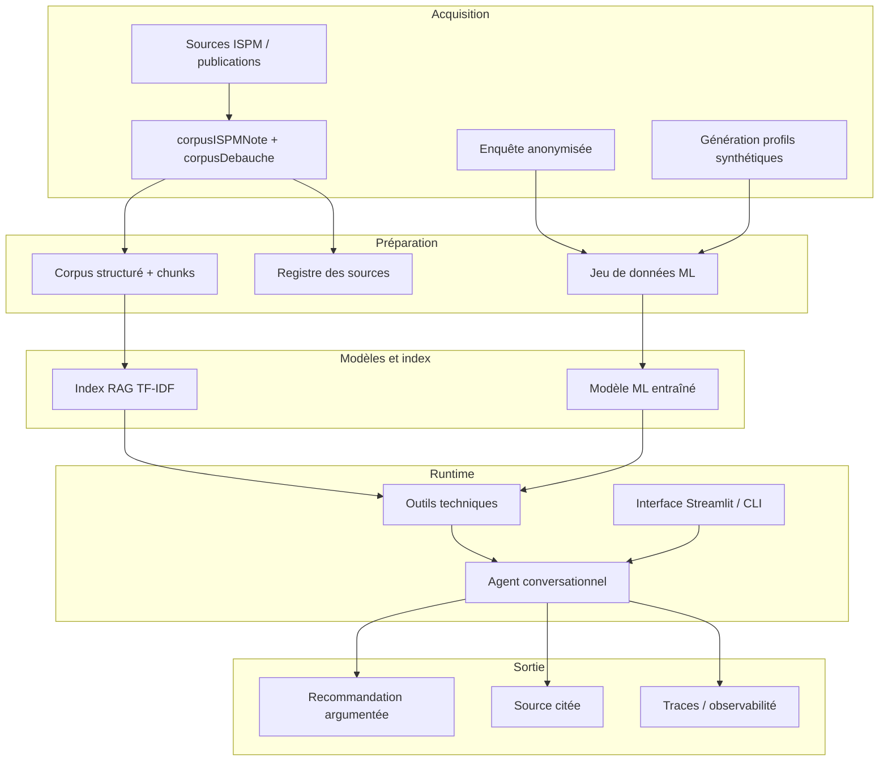
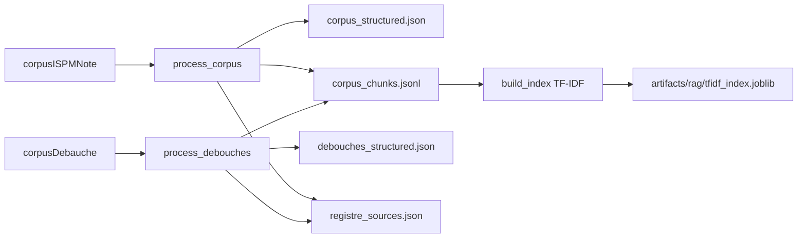
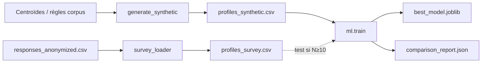
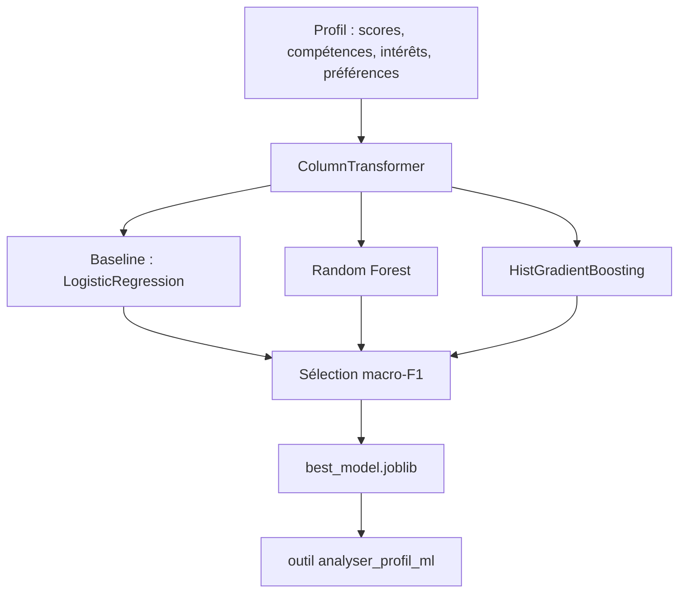
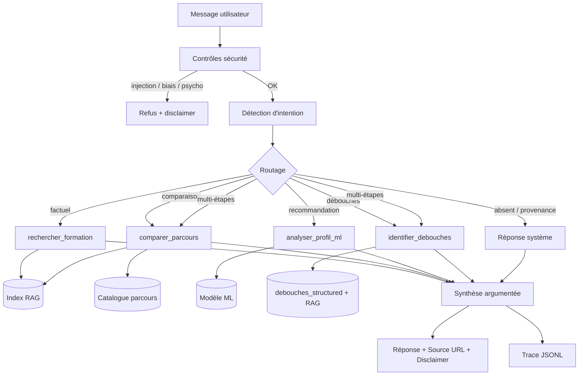
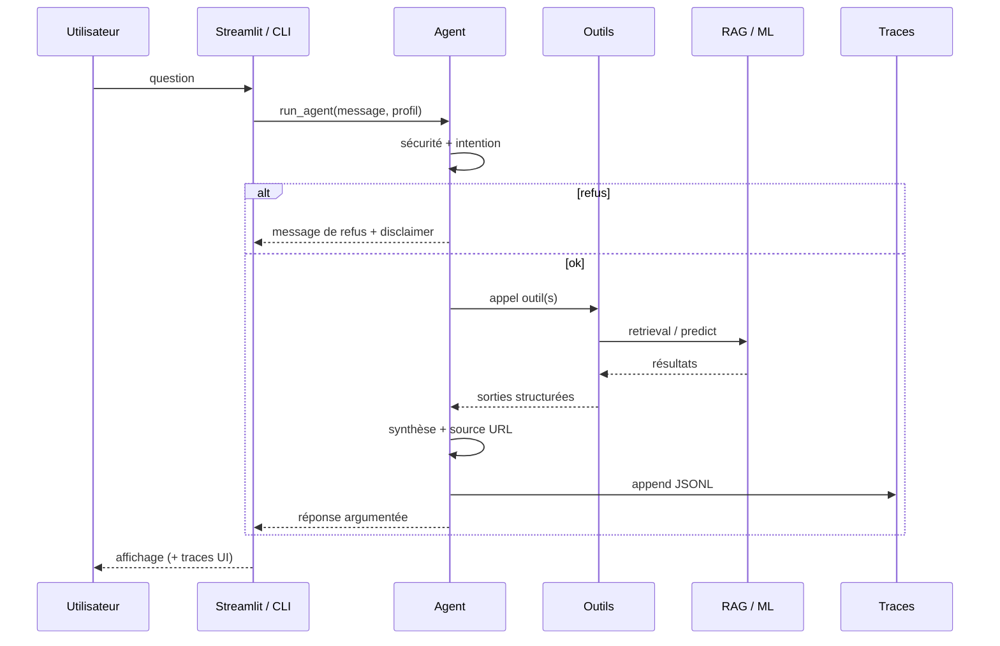
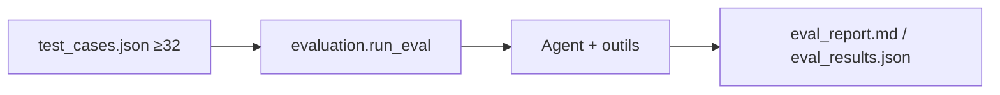

# Schéma d’architecture — Orient’IA

Assistant intelligent d’orientation pédagogique (ISPM).  
Prototype — Data Science · ML · RAG · Agents.

---

## 1. Vue d’ensemble

Deux chaînes d’acquisition convergent vers un **agent unique**, dont chaque décision reste traçable.



---

## 2. Chaînes de données

### 2.1 Corpus pédagogique (documents)



| Étape | Module | Sortie |
|-------|--------|--------|
| Parse notes formations | `orientia.data.process_corpus` | chunks parcours / matières |
| Parse débouchés | `orientia.data.process_debouches` | chunks `debouches_*` |
| Indexation | `orientia.rag.index` | index TF-IDF persistant |

Source publique citée côté utilisateur : `https://ispm-edu.com/publications.php`

### 2.2 Données Machine Learning (profils)



| Montage recommandé (sujet) | Usage |
|----------------------------|--------|
| Synthétique | entraînement |
| Enquête réelle | validation / test (si disponible) |
| Sinon | hold-out 20 % synthétique |

---

## 3. Machine Learning



- **Problème** : classification multi-classes → 16 parcours ISPM  
- **Features** : affinités 0–10, binaires compétences/intérêts, préférences catégorielles  
- **Pas de features sensibles** (sexe, âge, origine, etc.)

---

## 4. Agent conversationnel et outils



### Outils (≥ 3, ici 4)

| Outil | Type d’opération | Entrée | Sortie |
|-------|------------------|--------|--------|
| `rechercher_formation` | RAG lexical | requête texte | passages + score |
| `comparer_parcours` | catalogue + RAG | 2 codes parcours | axes / matières / citations |
| `analyser_profil_ml` | inférence ML | profil structuré | top-k parcours + scores |
| `identifier_debouches` | structuré + RAG | code parcours | métiers par catégorie |

Distinction affichée dans la réponse :
- résultats **ML**
- informations **documents**
- messages **système** (refus, absence, provenance)

---

## 5. Couches logicielles (dépôt)

```text
Orient'IA/
├── data/
│   ├── raw/corpus/          # notes brutes
│   ├── raw/survey/          # enquête
│   ├── processed/           # CSV profils
│   ├── corpus/              # JSON / JSONL structurés
│   ├── evaluation/          # ≥ 32 cas de test
│   └── metadata/            # registre, limites, labels
├── src/orientia/
│   ├── data/                # acquisition & préparation
│   ├── ml/                  # entraînement / predict
│   ├── rag/                 # index & search
│   ├── agent/               # tools + orchestrateur
│   ├── app/                 # Streamlit
│   └── evaluation/          # protocole d’évaluation
└── artifacts/
    ├── models/              # best_model.joblib
    ├── metrics/             # rapports ML
    ├── rag/                 # index TF-IDF
    ├── traces/              # observabilité agent
    └── evaluation/          # résultats des 32+ cas
```

---

## 6. Flux d’une requête (séquence)



---

## 7. Observabilité et sécurité

### Traces (`artifacts/traces/agent_traces.jsonl`)

Pour chaque tour : question, intention, profil extrait, outils appelés, sorties, réponse, latence, refus éventuel.

### Garde-fous

- injections de prompt / invention de filière → refus  
- recommandation par sexe / âge → refus  
- profilage psychologique → refus  
- info absente du corpus → non-invention + renvoi administration  
- disclaimer obligatoire dans l’interface et les réponses  

---

## 8. Évaluation



Catégories mesurées (sujet) : factuel, comparaison, ML, multi-étapes, absent, ambigu, sécurité, biais, provenance / psycho.

---

## 9. Principes directeurs

1. **Traçabilité** des sources et des appels d’outils  
2. **Séparation** ML / documents / règles  
3. **Prudence** : incertitude déclarée, pas de décision administrative  
4. **Mesure** : preuves expérimentales (ML + 32 cas) plutôt qu’affirmations  
